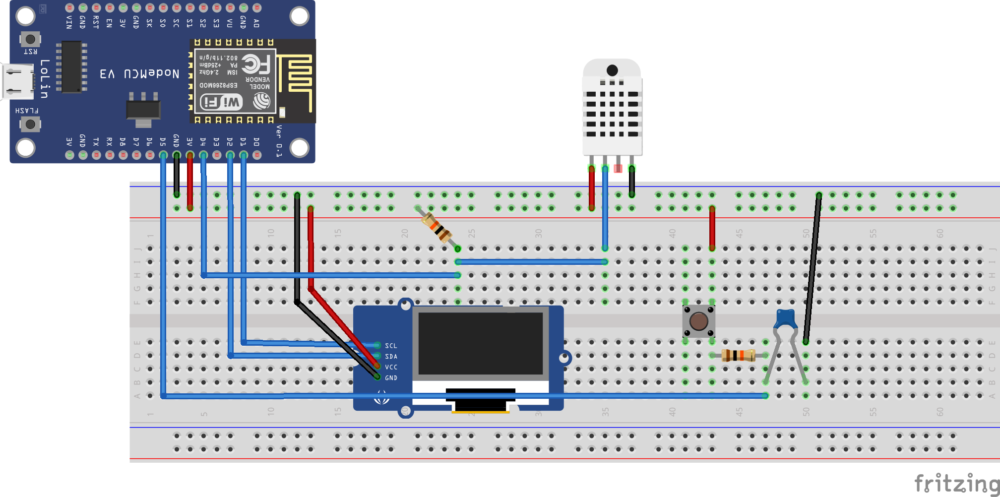
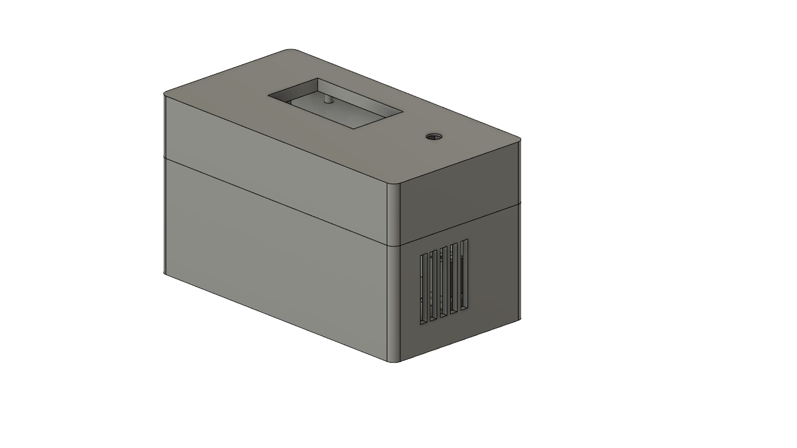

# Temperature Monitor

This project aims to be a simple introduction to IoT projects. Utilizing the
cost efficient ESP8266 with WiFi as the core. At the current prototype stage
the project relies on common breakout boards, mainly the DHT22 and OLED display.
Everything else is built, designed and written from scratch for this project.

Combined with a MQTT client or a Home Assistant instance this handy device
will serve as a practical addition to your IoT network. All devices are
powered by the USB port managed by the NodeMCU. There is support in the code
to add a battery but given that nothing is really optimized for power consumption
it probably won't last long enough.

The case is 3D-printable using PLA (only one tested, other materials are probably
just as fine). It consists of two separate parts to aid the assembly but have to
be glued together.

Modules used for this project:
* NodeMCU ESP6266
* OLED Parent 128 x 64 Pixel
* DHT22 AM2302 Temperature Sensor and Humidity Sensor